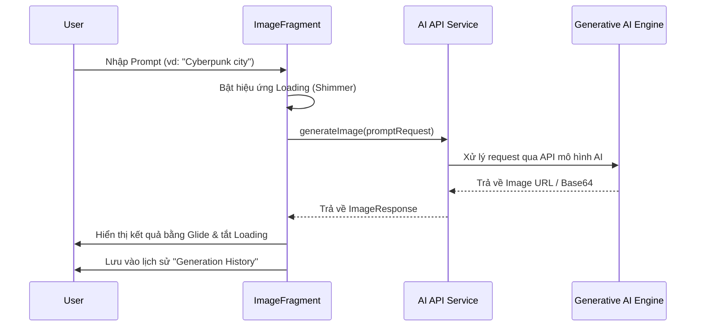
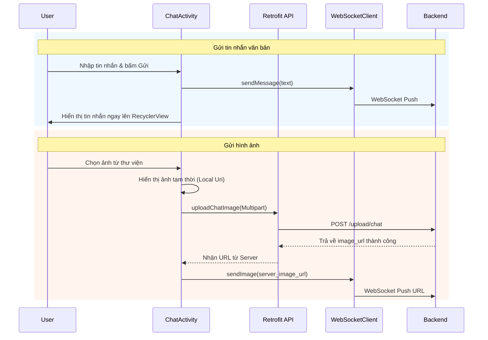
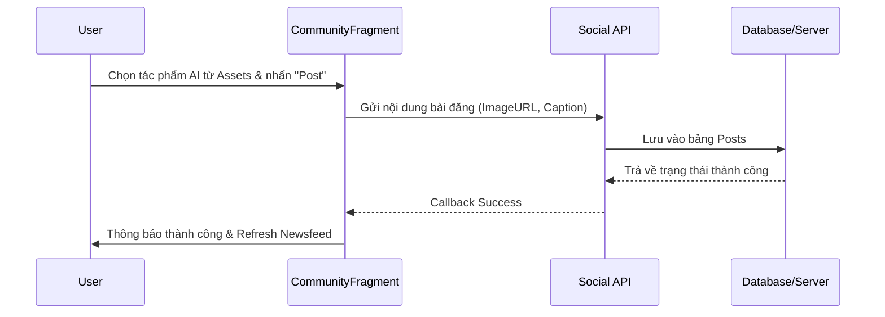

# MasterAI - Generative AI Social Network

**MasterAI** là một ứng dụng mạng xã hội tiên tiến tích hợp công nghệ AI tạo sinh (Generative AI), cho phép người dùng không chỉ kết nối, chia sẻ mà còn có thể sáng tạo nội dung (hình ảnh, giọng nói, avatar) trực tiếp thông qua các mô hình trí tuệ nhân tạo.

---

##  Kiến trúc dự án (Architecture)

Dự án được xây dựng theo mô hình **MVC (Model-View-Controller)**, được tùy biến để phù hợp với môi trường Android:

-   **Model**: Chịu trách nhiệm quản lý dữ liệu và logic nghiệp vụ. Bao gồm các POJO class, Retrofit API Services để giao tiếp với Backend. (Nằm trong package `com.example.masterai.model` và `com.example.masterai.api`).
-   **View**: Giao diện người dùng (UI). Bao gồm các file Layout XML, Fragments và Activities chịu trách nhiệm hiển thị dữ liệu. (Nằm trong package `com.example.masterai.ui` và thư mục `res/layout`).
-   **Controller**: Điều khiển luồng dữ liệu giữa Model và View. Trong dự án này, các Activity và Fragment đóng vai trò Controller, xử lý các sự kiện từ người dùng và cập nhật dữ liệu lên UI.

---

## Tech Stack

Ứng dụng sử dụng các công nghệ hiện đại trong hệ sinh thái Android:

-   **Ngôn ngữ**: Java
-   **Networking**: [Retrofit 2](https://square.github.io/retrofit/) & [OkHttp](https://square.github.io/okhttp/) (Xử lý API calls).
-   **Real-time**: [WebSocket](https://okhttp.host/docs/latest/okhttp/okhttp3/-web-socket/index.html) (Sử dụng OkHttp WebSocket cho Chat).
-   **Image Loading**: [Glide](https://github.com/bumptech/glide) (Tối ưu hiển thị hình ảnh từ URL).
-   **Media**: [Media3 ExoPlayer](https://developer.android.com/guide/topics/media/exo-player) (Phát âm thanh/video do AI tạo ra).
-   **UI Components**: Material Design, [Shimmer](https://facebook.github.io/shimmer-android/) (Hiệu ứng loading), DataBinding.
-   **Data Handling**: GSON (Parse JSON), Paging 3 (Phân trang dữ liệu mạng xã hội).

---

## Tính năng chính

1.  **AI Generation**:
    *   **Image Gen**: Tạo ảnh nghệ thuật từ văn bản (Prompt to Image).
    *   **Voice Gen**: Chuyển đổi văn bản thành giọng nói (TTS) đa dạng ngôn ngữ.
    *   **Avatar Gen**: Tạo ảnh đại diện cá nhân hóa theo phong cách AI.
2.  **Cộng đồng (Community)**: Chia sẻ các tác phẩm AI, like, bình luận và tìm kiếm người dùng.
3.  **Chat (Real-time)**: Nhắn tin văn bản và gửi hình ảnh tức thời qua WebSocket.
4.  **Profile**: Quản lý bộ sưu tập các tài sản AI (Assets) và thông tin cá nhân.

---

## Sequence Diagrams

### 1. Quy trình Tạo sinh ảnh AI (AI Image Generation)
Mô tả luồng từ lúc người dùng nhập Prompt đến khi nhận kết quả.

### 2. Quy trình Nhắn tin (Chat & Upload Image)
Mô tả luồng nhắn tin thời gian thực tích hợp gửi file ảnh.

### 3. Quy trình Đăng bài lên Cộng đồng

---

## Cài đặt

1.  Clone project: `git clone https://github.com/your-username/MasterAI.git`
2.  Mở bằng **Android Studio**.
3.  Đảm bảo đã cài đặt **JDK 11**.
4.  Sync Gradle và Run ứng dụng trên Emulator (API 24+) hoặc thiết bị thật.

---
© 2026 MasterAI Team - Mang trí tuệ nhân tạo đến gần hơn với cộng đồng.
